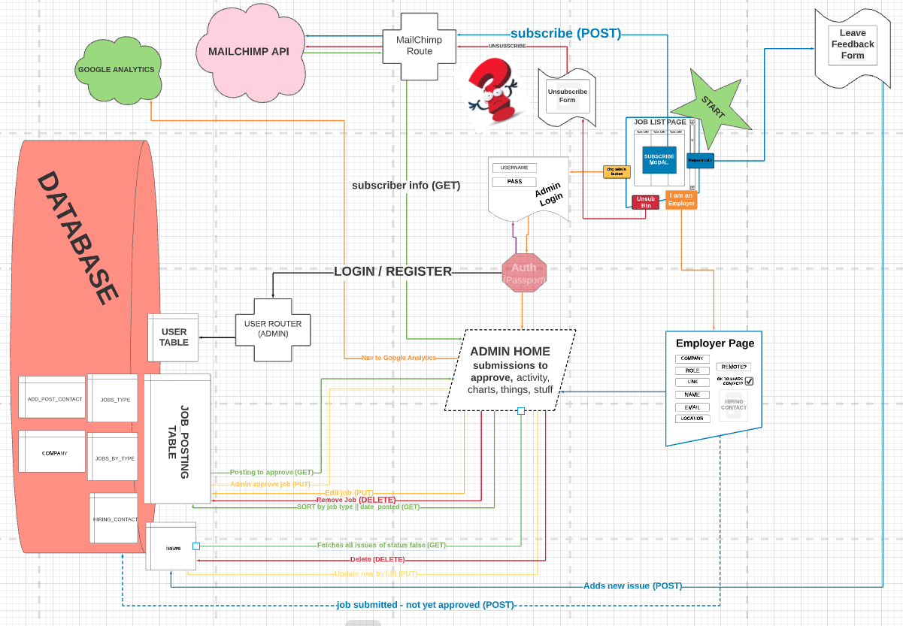
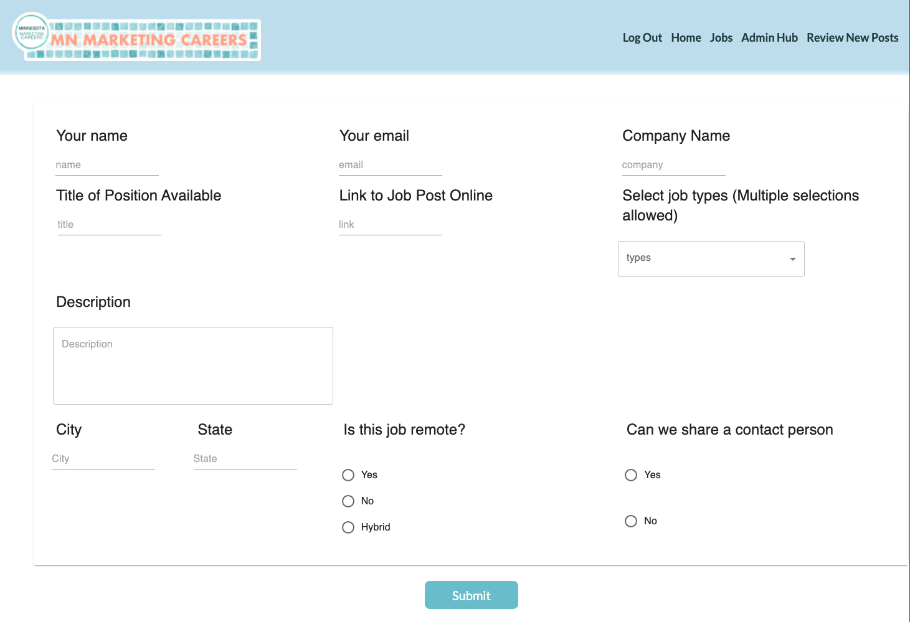
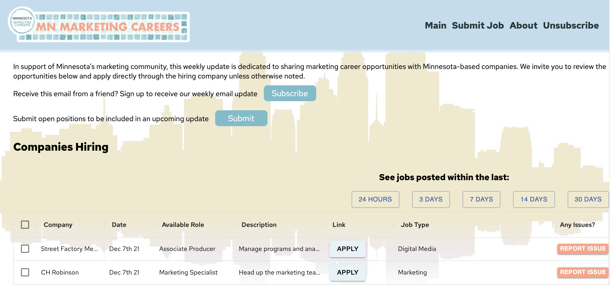

# <b>MN Marketing Careers Application</b>


##### _Duration: 2 Week Sprint_

## Description


This application provides improved and expanded functionality for the curators of the MN Marketing Careers job list sharing service and increased accessibility to the the subscribers to that list, and employers looking to include new job openings. It aims to gather all current methods in use by the client in one place. With that in mind, it was designed to continue to utilize MailChimp functionality for the client to incorporate existing practices and subscriber contact data conveniently and effectively into the application. The app was then customized for more interaction between employers looking to post jobs, job-seekers, and the job list curators. The job list now lives on a page where job seekers can see all previous postings up to 30 days after initiation, and can sort and filter results by a few predetermined categories. The job list curator can also manage listings with more control. 

The star of the app may be the **MailChimp API integration**. Admin curators AND visitors to the site are able to submit job postings to this app which are stored in a backend database (pending administrator approval). Whenever the admin desires, they can automatically populate all of these submissions - in the _same format_ which they have previously used - input a subject line, preview in the browser and send away.


To see the fully functional site, please visit: [DEPLOYED VERSION OF APP](https://mnmarketingcareers.herokuapp.com/)

## Screen Shot


To gain a working understanding of the data pathways, one might reference the following chart.




Additionally, an example of the site administrators form to add new job openings to the list.




A brief example of the Job submission for for an employer:


Finally, here's the main page of the application where job seekers and hiring managers first interact with the application.




And a Main page usage example 1:


Main page example 2:


Admin hub example:


## Prerequisites

Link to software that is required to install the app (e.g. node).

- MailChimp account (with API_KEY)
- [Node.js](https://nodejs.org/en/)
- [PostrgeSQL](https://www.postgresql.org/)
- [Nodemon](https://nodemon.io/)
- [Google Recaptcha] (https://www.google.com/recaptcha/about/)
- [Google Marketing Platform] (https://marketingplatform.google.com/about/)
  - From this platform, you can create Google Analytics and Google Tag Manager products

## Installation

- Before spinning up the project, make sure you have an active MailChimp account, to which to link the project. 
- Create a .env file at the root of the project and paste this line into the file:
  SERVER_SESSION_SECRET=superDuperSecret 
  While you're in your new .env file, take the time to replace superDuperSecret with some long random string like 25POUbVtx6RKVNWszd9ERB9Bb6 to keep your application secure. Here's a site that can help you: https://passwordsgenerator.net/. If you don't do this step, create a secret with less than eight characters, or leave it as superDuperSecret, you will get a warning.
- You will need to generate/locate your MailChimp api key (basic instructions here [mailchimp_gettingstarted](https://mailchimp.com/developer/marketing/guides/quick-start/#generate-your-api-key)). Use this to replace the text immediately after `MAILCHIMP_API_KEY=` in the lines below.
- Your "server prefix" is found in the url of your MailChimp dashboard when logged in. It immediately follows the `https://` and precedes the first `.` Use this to replace the text immediately after `DC=` (which stands for "data center" and likely starts with `us`) in the lines below.
- Find you "Audience" Id in your Audience settings on your MailChimp account. Use this to replace the text immediately after `TEST_LIST_ID=` in the lines below.
- Replace sample text in each of the following 3 lines as mentioned above, and include in your `.env` file

```
      SERVER_SESSION_SECRET=secret_site_key_here
      DC=three_character_dc
      MAILCHIMP_API_KEY=your_maichimp_api_key
      TEST_LIST_ID=your_account_id_number

      REACT_APP_RECAPTCHA_SITE_KEY=recaptcha_site_key_here
      RECAPTCHA_SECRET_KEY=recaptcha_secret_key_here

      REGULAR_TEMPLATE_ID=template_id_here
      PLAIN_TEXT_TEMPLATE_ID=text_template_here
```

- _*Make sure `.env` is in your .gitignore!*_

Next:

1. Create a database named `mn_marketing_careers`,
2. The queries in the `database.sql` file are set up to create all the necessary tables and populate the needed data to allow the application to run correctly. The project is built on [Postgres](https://www.postgresql.org/download/), so you will need to make sure to have that installed. We recommend using Postico to run those queries as that was used to create the queries 
3. Open up your editor of choice and run an `npm install`
4. Run `npm run server` in your terminal
5. Run `npm run client` in another terminal tab (this should open a browser tab for you)

## Usage


1. Go to the main page, linked from email
2. See the jobs - Click around
3. use the search bar to filter results
4. Apply!
5. Select a column header to sort by given column
6. If you have a job to post, follow the link to send it to the admin
7. If you are aware of an issue with a job post, follow the link to inform the admin
8. You may unsubscribe at the link at the bottom - we'll have a couple questions for you
9. The site also includes functionality for page administrators ('admins')
10. Admins need to login at a private url to access these features
11. Logged in admins will see a list of notifications
12. Notifications include pending job posts added by potential empoloyers, and any issues sent from users on the main page
13. Admins will also be able to view all active listings, with options to edit, delete, or deactivate job listings
14. Admins may approve or deny pending job posts
15. Admins may address issues and mark them complete, or delete them
16. Admins may draft new job postings and save them to a queue to post live at a later time
17. Admins may draft a weekly email which will feature new job listings and, on send, will post new job listings to the main webpage
18. Admins may choose to post new job listings in the queue to the main webpage without sending the email
19. Admins may log out when finished

## Built With

1. JavaScript
2. React
3. Redux
4. Mailchimp API
5. Material-UI
6. Express
7. Postgres
8. Node.js
9. HTML/css


## License
[MIT](https://choosealicense.com/licenses/mit/)

_Note, include this only if you have a license file. GitHub will generate one for you if you want!_

## Acknowledgement
Thanks to [Prime Digital Academy](www.primeacademy.io) who equipped and helped me to make this application a reality. And a huge thanks to Casey Tilli and Elizabeth Laukka with Minnesota Marketing Careers for allowing our dev team to create this application in your vision. You are both doing some amazing work for the job seeking community.

## Support
If you have suggestions or issues, please email us at [franck.bushbaum@yahoo.com], [cmochinski@gmail.com], [gregtambornino@gmail.com], or [dannymussie7@gmail.com]
